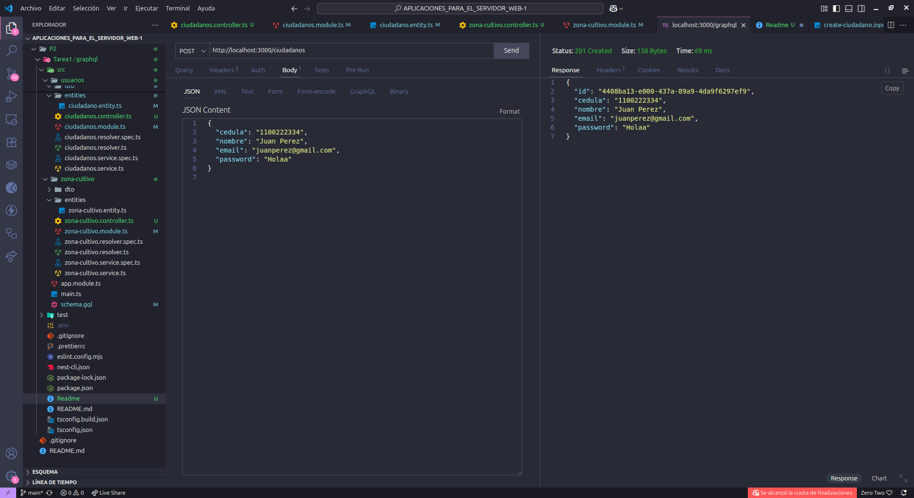
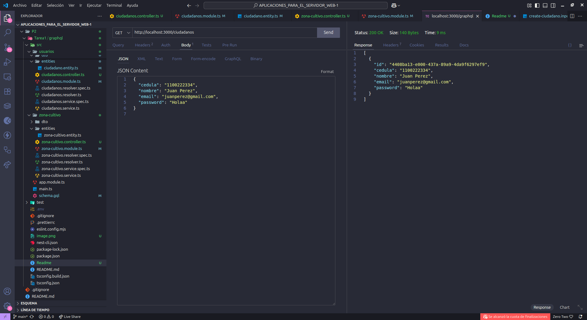
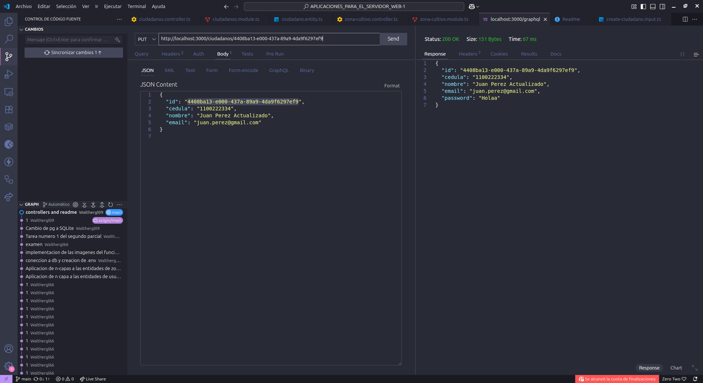
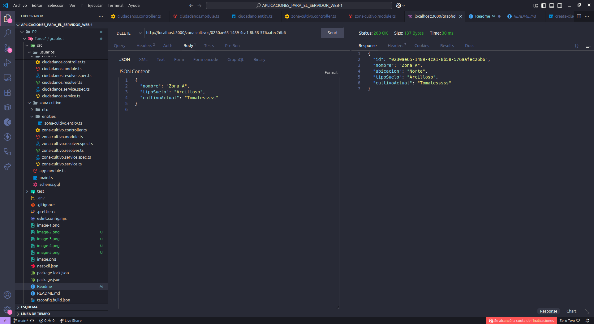
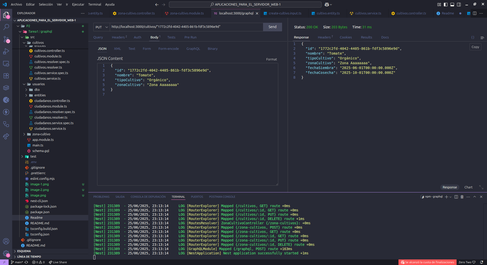
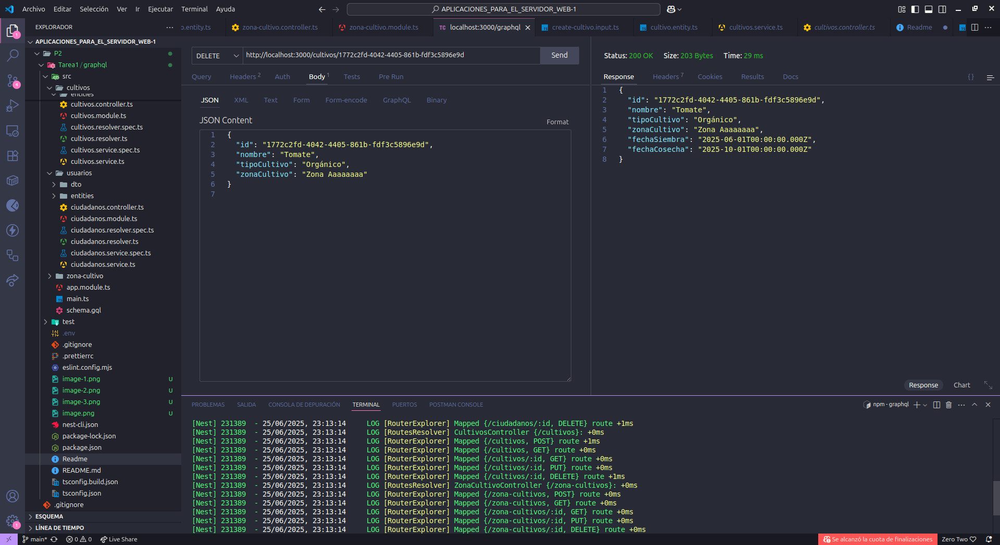
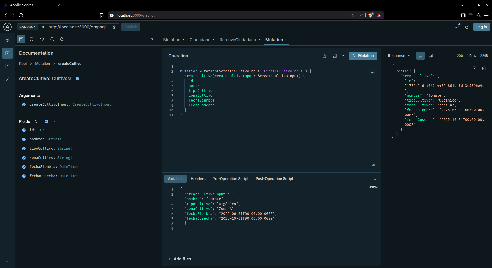
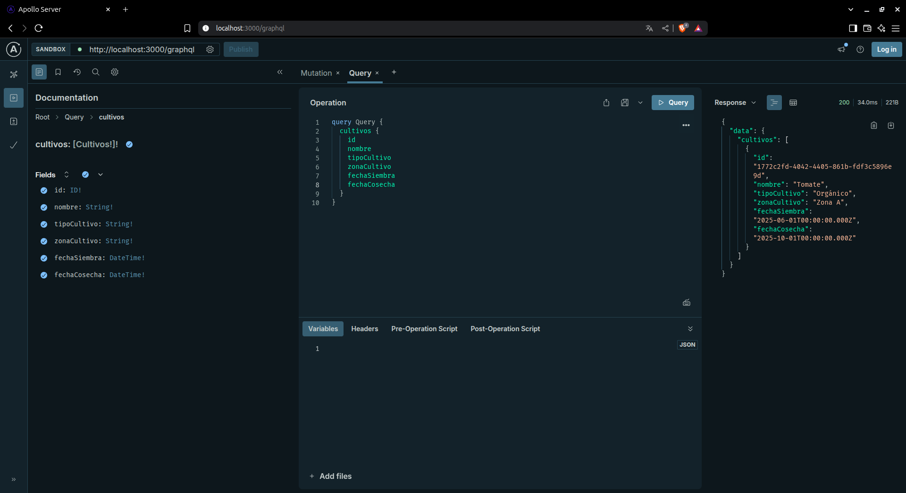

# Proyecto de Gestión de Cultivos 

Este es un proyecto desarrollado con **NestJS** para gestionar la información de usuarios, zonas de cultivo y cultivos. El proyecto permite realizar operaciones CRUD sobre estas entidades utilizando una base de datos **SQLite**. Además, se exponen los servicios a través de una API **GraphQL**.

## Descripción del Proyecto

Este proyecto tiene como objetivo gestionar y mantener un registro de los usuarios, las zonas de cultivo y los cultivos que se llevan a cabo en dichas zonas. Cada usuario tiene datos como nombre, cédula y correo electrónico, mientras que las zonas de cultivo incluyen detalles sobre su ubicación, tipo de suelo y cultivo actual. Los cultivos contienen información sobre el tipo de cultivo y las fechas de siembra y cosecha.

## Instalación

### 1. Clonar el repositorio

Primero, clona este repositorio en tu máquina local:

***bash**
git clone https://github.com/Walthergl66/APLICACIONES_PARA_EL_SERVIDOR_WEB

### instalar dependencias y arrancar app
npm install

npm run start:dev

### El proyecto utiliza GraphQL para exponer la API.
Puedes interactuar con la API a través de la interfaz de GraphQL 
ubicada en http://localhost:3000/graphql.

Tambien por medio de solicitudes de endpoints

# Get Post Put Patch Delete
http://localhost:3000/ciudadanos

http://localhost:3000/zona-cultivos

http://localhost:3000/cultivos

# funcionamiento en http://localhost:3000/graphql

